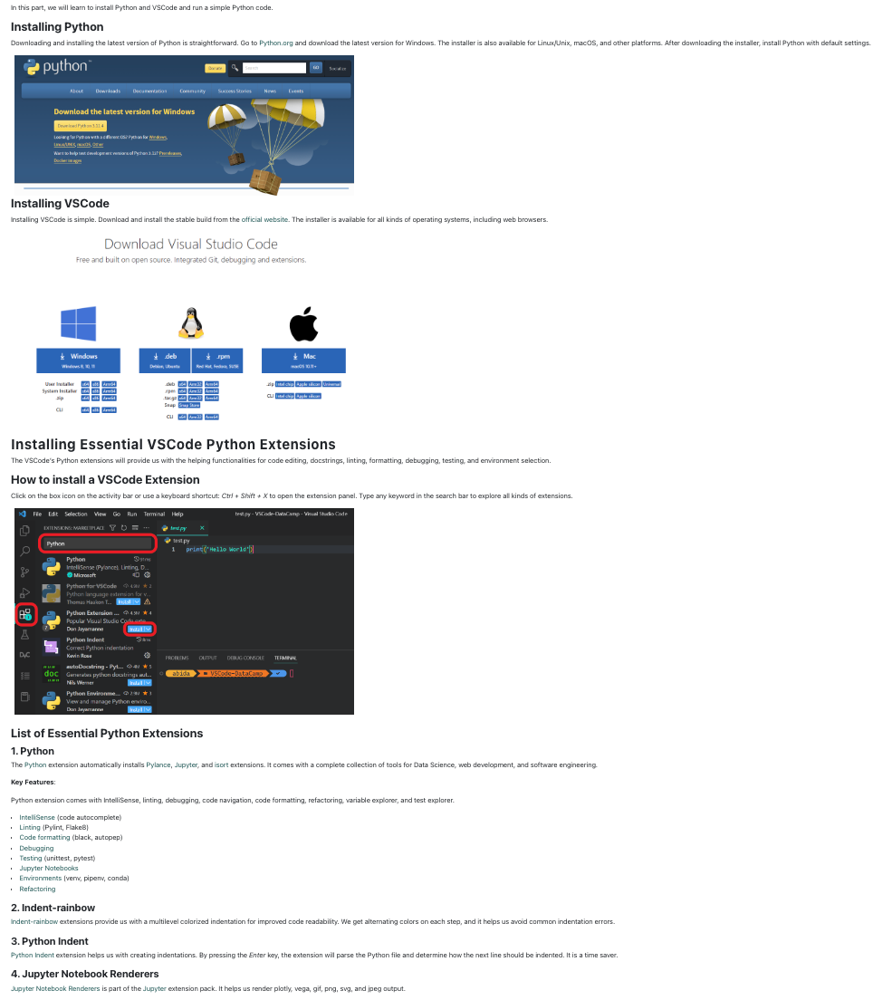
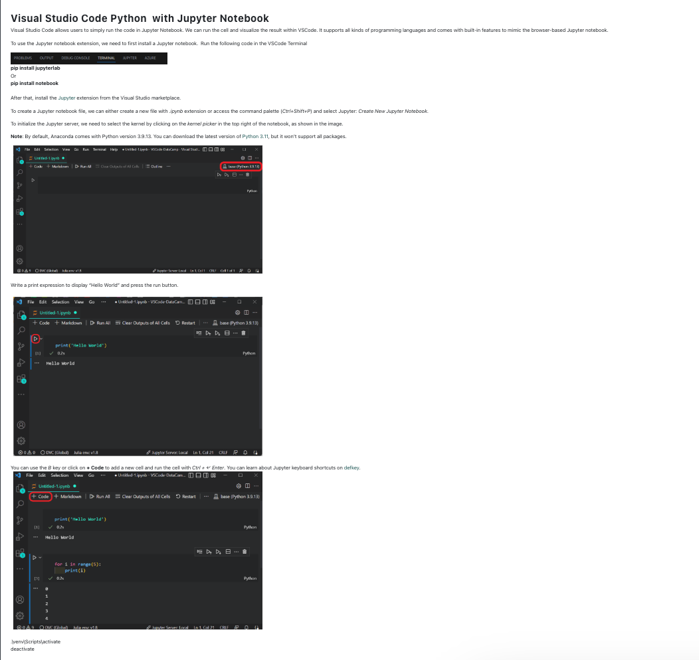

Week 1 useful source:

1. python download Click https://www.python.org/downloads/ link to open resource.

2. VScode download Click https://code.visualstudio.com/download link to open resource.

3. Python and Visual Studio Code Setup

    
    

4. Machine Learning Project Ideas

    ##### Black Friday Sales Prediction

    The dataset contains demographic information for customers (including age, gender, marital status, location, and more) as well as product details and total purchase amounts. A training data set and a testing data set are available.

    https://www.kaggle.com/datasets/cerolacia/black-friday-sales-prediction?resource=download

    ##### Million Song Analysis

    Use this subset of the Million Song Dataset to predict the release year of a song from its audio features. The songs are primarily commercial Western tracks dating from 1922 to 2011, although the dataset does not include any audio—it consists of derived features only.

    http://archive.ics.uci.edu/dataset/203/yearpredictionmsd

    ##### Movie Recommendation Engine

    Netflix uses collaborative filtering as part of its complex recommendation system, and with the MovieLens Dataset. Collaborative filtering recommendation engines analyze user behavior/preferences and similarities between users to predict what users will like. 

    https://grouplens.org/datasets/movielens/1m/

    ##### YouTube Comment Analysis

    If you want to analyze YouTube comments with natural language processing techniques, start by scraping your text data by leveraging a library like Youtube-Comment-Scraper-Python, which fetches YouTube video comments using browser automation.

    https://pypi.org/project/youtube-comment-scraper-python/

    #### Hate Speech Detection

    you can develop a hate speech detection model using a dataset originally collected from Twitter. This interesting machine learning problem will revolve around sentiment classification. Learn more about creating a hate speech detection model with Python here.

    https://thecleverprogrammer.com/2021/07/25/hate-speech-detection-with-machine-learning/

    ##### Speech Emotion Recognition

    In the Speech Emotion Recognition with Librosa project, you will process sound files using Librosa, sound file, and sklearn for the MLPClassifier to recognize emotion from sound files. 

    You will load and process sound files, perform feature extraction, and train the Multi-Layer Perceptron classifier model. The project will teach you the basics of audio processing so that you can advance into training a deep learning model to achieve better accuracy. 

    https://data-flair.training/blogs/python-mini-project-speech-emotion-recognition/

    ##### Naïve Bees: Deep Learning with Images

    you will build and train a deep learning model to distinguish between honey bees and bumble bees images. You will start with image and label data processing. 

    https://www.datacamp.com/projects/555

    ##### Stock Market Analysis And Forecasting

    https://medium.com/nerd-for-tech/stock-market-analysis-and-forecasting-using-deep-learning-f75052e81301

    ##### Reinforcement Learning for Connect X

    https://www.kaggle.com/competitions/connectx

    ##### Some other sources:

    https://medium.com/mlearning-ai/machine-learning-projects-with-source-code-in-python-easy-projects-intermediate-projects-and-d289f5f1328e

    https://www.projectpro.io/article/machine-learning-projects-for-students-with-source-code/503

    https://www.projectpro.io/article/top-10-machine-learning-projects-for-beginners-in-2021/397

    https://data-flair.training/blogs/machine-learning-project-ideas/

5. Math for Machine Learning

    Click https://www.youtube.com/watch?v=uZeDTwWcnuY&list=PLD80i8An1OEGZ2tYimemzwC3xqkU0jKUg link to open resource.

6. Linear Models in Scikit-Learn

    Click https://scikit-learn.org/stable/modules/linear_model.html link to open resource.

7.  Introduction to Python

    Click https://youtu.be/_uQrJ0TkZlc link to open resource.

8.   Python in Machine Learning Tutorial

    Click https://youtu.be/7eh4d6sabA0 link to open resource.

9.  Python environments in VS Code

    Click https://code.visualstudio.com/docs/python/environments link to open resourc
